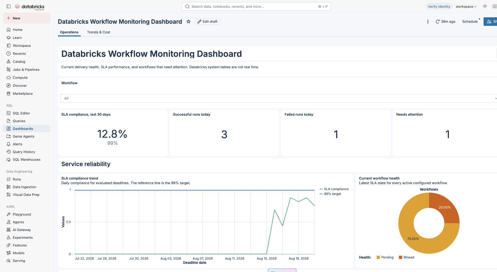
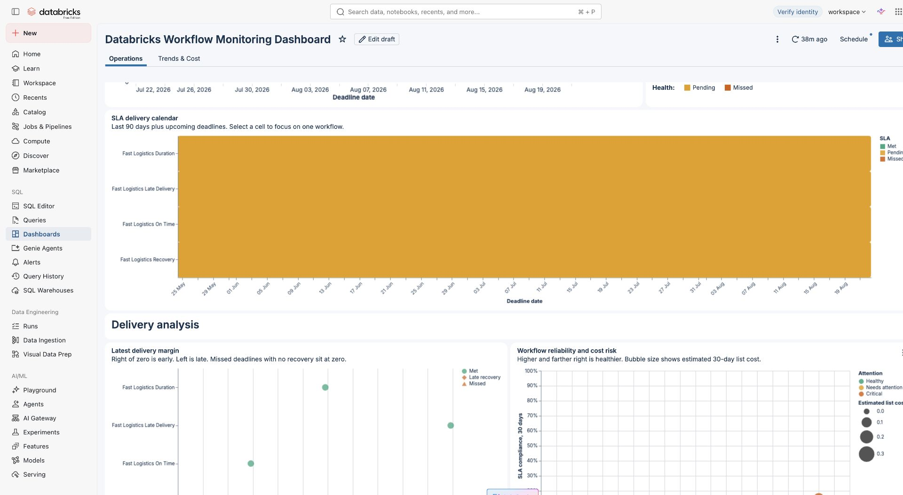
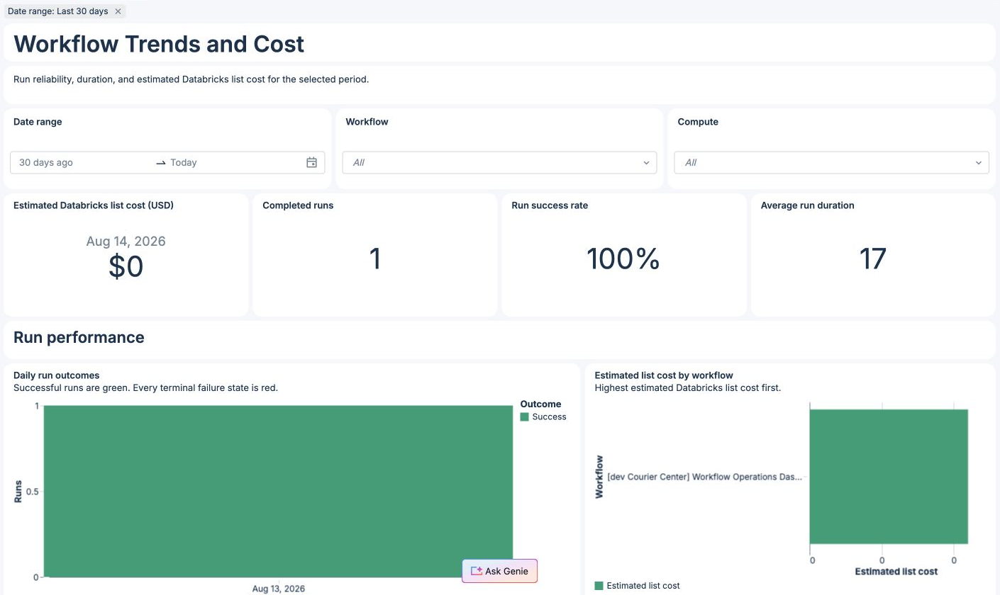

# Databricks Workflow Monitoring Dashboards

## Overview

An open-source, config-based dashboard for monitoring the [Lakeflow Jobs](https://docs.databricks.com/aws/en/jobs/monitor) that deliver your data. Define each job's expected completion time in YAML, then see which jobs met or missed their dashboard-defined SLA.

Choose the jobs and monitoring source in one YAML file. A small Python module validates the configuration and generates a Databricks AI/BI dashboard. A [Declarative Automation Bundle](https://docs.databricks.com/aws/en/dev-tools/bundles/), formerly called a Databricks Asset Bundle, deploys it across environments.

```text
workflow-monitoring.yml -> validator and generator -> dashboard plus optional collector Job
```

`system_tables` uses read-only monitoring queries. `jobs_api` polls current Jobs API state into two managed Delta tables, then refreshes the dashboard. The optional demo bundle creates disposable example jobs.

> [!NOTE]
> `jobs_api` targets five-minute freshness, not real-time alerting. Scheduled jobs can still start several minutes late. Cost always uses delayed billing system tables and is estimated Databricks list cost. It excludes negotiated discounts and classic cloud-provider VM charges.

## Motivation

Data teams enable other teams by making trusted data available when they need it. That delivery often has a clear daily, weekly, or monthly deadline.

Downstream teams need to know whether the workflows that prepare their data are healthy and meeting those deadlines. Data leaders also need simple SLA metrics without asking engineers to prepare a manual status report.

This repository turns that recurring need into a reusable Lakeflow Jobs operations dashboard. Each team chooses the workflows that matter, defines their expected completion times, and gets one shared view of job health, SLA performance, failure trends, and estimated Databricks cost.

The current SLA measures successful workflow completion. It does not prove that every downstream table or data product is ready.

## What you need

| Tool | Why |
| --- | --- |
| `uv` 0.12 or newer | Install the locked Python environment and run commands. |
| Databricks CLI 0.292 or newer | Discover IDs and validate or deploy the bundle. |
| `jq` | Read CLI JSON and validate dashboard JSON. |
| Docker and `act` | Run the repository's local validation workflows. |

The project needs Python 3.11 or newer. `uv` can use an installed Python or download one when your organization allows it.

## Start here

You normally edit only one file:

| File | What you do |
| --- | --- |
| `workflow-monitoring.template.yml` | Copy this tracked template before adding real values. |
| `schema/workflow-monitoring.schema.json` | Do not edit unless the public configuration format changes. |
| `workflow_monitoring_dashboard.py` | Edit only when changing validation or generation behavior. |
| `src/collect_workflow_monitoring_jobs_api.py` | Edit only when changing Jobs API collection behavior. |
| `src/dashboards/workflow-monitoring.scaffold.lvdash.json` | Edit only when changing dashboard SQL or layout. |
| `src/visualizations/*.vega.json` | Edit only when changing a custom chart. |
| `src/dashboards/workflow-monitoring.lvdash.json` | Never edit directly. The Python generator replaces it. |

Bundle targets and variables live in `databricks.yml`. Python dependencies are locked in `pyproject.toml` and `uv.lock`.

## Adapt it to your workflows

### 1. Choose your Databricks profile

List every local profile:

```sh
databricks auth profiles
```

Use `--profile <name>` on every live command. The project never stores or automatically selects a profile.

If the selected profile is not valid, authenticate it before continuing.

### 2. Find your workspace and warehouse IDs

Find the workspace ID:

```sh
databricks auth describe --profile <name> --output json \
  | jq -r '.details.configuration.workspace_id.value'
```

Find the default SQL warehouse:

```sh
databricks experimental aitools tools get-default-warehouse \
  --profile <name>
```

Put the workspace ID in `workflow-monitoring.yml`. Keep the warehouse ID outside Git and pass it with `--var` when validating or deploying.

### 3. Choose monitoring freshness

Create your ignored local configuration:

```sh
cp workflow-monitoring.template.yml workflow-monitoring.yml
```

Keep the read-only source when system-table delay is acceptable:

```yaml
monitoring_data_source_config:
  source: system_tables
```

Use the Jobs API source for five-minute operational status:

```yaml
monitoring_data_source_config:
  source: jobs_api
  refresh_interval_minutes: 5
  storage:
    catalog: workflow_monitoring
    schema: lakeflow_jobs
```

If `storage` is omitted, the dedicated fallback is `workflow_monitoring.lakeflow_jobs`. The collector creates that catalog and schema when its run identity has permission. It never selects an unrelated existing catalog.

| Source | Freshness | Creates resources | Active `job_id` |
| --- | --- | --- | --- |
| `system_tables` | Databricks ingestion delay | Dashboard only | optional |
| `jobs_api` | five-minute polling target | Collector Job and two managed Delta tables | required |

### 4. Add the workflows you care about

Replace the inactive example in `workflow-monitoring.yml`:

```yaml
# yaml-language-server: $schema=./schema/workflow-monitoring.schema.json

version: 2
monitoring_data_source_config:
  source: jobs_api
  refresh_interval_minutes: 5
  storage:
    catalog: workflow_monitoring
    schema: lakeflow_jobs
workspace_id: "1234567890123456"
default_timezone: UTC

workflows:
  - job_name: daily_orders
    job_id: 123456
    monitoring_status: active
    sla:
      frequency: daily
      completion_time: "06:00"
      timezone: Australia/Melbourne
```

`job_id` is required for `jobs_api`. It is optional for `system_tables`, but preferred because it stays stable if a workflow is renamed.

### 5. Validate and generate

Run both commands from the repository root:

```sh
uv sync --locked --no-dev
uv run --no-dev python workflow_monitoring_dashboard.py validate
uv run --no-dev python workflow_monitoring_dashboard.py generate
```

Your organization may commit `workflow-monitoring.yml` and the generated `.lvdash.json` to its own repository according to its security policy. Contributions to this public upstream repository must keep fake values in the example and generated dashboard.

For `jobs_api`, generation also creates the ignored `resources/workflow-monitoring.jobs-api.job.yml`. Switching back to `system_tables` removes that generated collector resource.

## Workflow fields

| Field | Required for active workflow | Meaning |
| --- | --- | --- |
| `job_name` | yes | Exact Lakeflow job name shown in Databricks. |
| `job_id` | source-dependent | Required by `jobs_api`. Optional but preferred for `system_tables`. |
| `monitoring_status` | yes | `active` includes it. `inactive` excludes it. |
| `sla.frequency` | yes | `daily`, `weekly`, `fortnightly`, or `monthly`. |
| `sla.completion_time` | yes | Expected completion time in `HH:MM` format. |
| `sla.timezone` | no | IANA timezone. Uses `default_timezone` when omitted. |

## Schedule examples

Use only the fields shown for the selected frequency.

| Frequency | Extra field | Example |
| --- | --- | --- |
| Daily | none | `frequency: daily` |
| Weekly | `day_of_week` | `day_of_week: monday` |
| Fortnightly | `first_deadline_date` | `first_deadline_date: "2026-01-12"` |
| Monthly | `day_of_month` | `day_of_month: 31` |

A monthly day of 29, 30, or 31 uses the month's final day when the month is shorter.

Complete examples:

```yaml
# Weekly
sla:
  frequency: weekly
  completion_time: "06:00"
  day_of_week: monday

# Fortnightly
sla:
  frequency: fortnightly
  completion_time: "06:00"
  first_deadline_date: "2026-01-12"

# Monthly
sla:
  frequency: monthly
  completion_time: "06:00"
  # Uses February 28, February 29 in leap years, and day 30 in shorter months.
  day_of_month: 31
```

`day_of_month` is the preferred deadline day. When that day does not exist, the deadline uses the final day of that month. For example, `day_of_month: 31` becomes February 28 in 2026, February 29 in a leap year, and April 30.

## Pause monitoring without deleting configuration

Set the entry to inactive:

```yaml
workflows:
  - job_name: daily_orders
    monitoring_status: inactive
```

Inactive entries are ignored after basic YAML parsing. They are excluded from every query, filter, KPI, cost, and active-workflow validation rule.

Zero active workflows is valid. The generated dashboard returns empty results instead of failing.

## How workflow resolution works

1. `jobs_api` resolves every active workflow by required `job_id`.
2. `system_tables` resolves by ID when present, otherwise exact `job_name`.
3. Missing IDs, missing names, duplicate name matches, and ID/name mismatches appear in Configuration problems.
4. Unresolved workflows are excluded from run, SLA, and cost metrics.
5. Every active YAML entry still appears in Workflow health.

> [!WARNING]
> With `system_tables`, a new or renamed workflow can temporarily appear as `Missing job ID`. Wait for ingestion and refresh before treating it as a configuration error. With `jobs_api`, check `workflow_api_collection_status` for collection failures.

## Optional disposable demo

[`examples/fast-logistics`](examples/fast-logistics/README.md) is a standalone, paused-by-default job bundle for reproducing dashboard shapes without storing workspace or user information. Deploy it only when needed and destroy it afterwards.

It helps data teams:

- monitor selected Databricks jobs instead of every job in the workspace;
- track daily, weekly, fortnightly, and monthly workflow SLAs;
- investigate successful runs, failures, missed deadlines, and run duration;
- analyse 30-day Databricks job cost using system billing tables;
- deploy the same dashboard configuration across environments.

## Dashboard views

### Operations overview



See current SLA compliance, today's terminal run outcomes, workflows needing attention, and workflow health at a glance.

### Dashboard-defined SLA monitoring



Review deadline status, delivery margin, and workflow reliability risk with custom Vega-Lite visualizations.

### Workflow trends and estimated cost



Filter 30-day run outcomes, success rate, duration, and estimated Databricks list cost by workflow and compute type.

## Dashboard reference

### Operations page

The first page answers three questions: are workflows delivering on time, what failed today, and what needs attention?

| Visual | Meaning |
| --- | --- |
| SLA compliance | Percentage of evaluated deadlines met during the last 30 days, compared with the 99% reference target. |
| Successful and failed runs | Terminal run executions completed today in UTC. Success is green and failure is red. |
| Needs attention | Active workflows with a missed SLA or configuration problem. |
| SLA compliance trend | Daily SLA compliance during the last 30 days. |
| Current workflow health | Green for met, amber for pending, red for missed, and purple for configuration problems. |
| SLA delivery calendar | A 90-day status calendar with upcoming deadlines and workflow selection. |
| Latest delivery margin | Shows how early or late each workflow delivered against its latest due deadline. |
| Workflow reliability and cost risk | Compares 30-day run success, SLA compliance, and estimated list cost. |
| Workflow health | Current SLA, latest run, next deadline, compute type, and configuration state. |

Success and failure metrics count run executions. They do not count workflow definitions. The page does not include a compute breakdown chart.

### Status colours

The dashboard uses the same colour for each status everywhere:

| Status | Colour | Hex value |
| --- | --- | --- |
| Success or SLA met | Green | `#009E73` |
| Failure or SLA missed | Red | `#D55E00` |
| SLA pending | Amber | `#E69F00` |
| Configuration problem | Purple | `#7B61A8` |
| Paused or no data | Grey | `#767676` |

Every visual also shows a text label. Colour is not the only way to understand a status.

### Trends and cost page

The second page defaults to the last 30 days and contains:

1. Estimated Databricks list cost, completed runs, run success rate, and average duration.
2. Daily run outcomes with semantic success and failure colours.
3. Estimated cost by workflow and daily cost trend.
4. Average run-duration trend.
5. Latest run-duration lanes for the newest 100 filtered runs.
6. Workflow run details.

Cost uses `system.billing.usage` and the price active in `system.billing.list_prices`. It excludes negotiated discounts and classic cloud-provider VM charges. See the [Databricks list-cost documentation](https://docs.databricks.com/aws/en/admin/usage/system-tables).

Compute type uses billing metadata attached to each run. It shows `Unknown` when matching billing metadata has not arrived or is unavailable.

### Custom visualizations

The dashboard keeps standard cards, charts, and tables where they are clearest. Four views use Databricks custom Vega-Lite visualizations:

1. SLA delivery calendar.
2. Latest delivery margin.
3. Workflow reliability and cost risk.
4. Latest run-duration lanes.

Their readable source files live in `src/visualizations/`. The generator serializes them into the tracked dashboard JSON. Edit the Vega-Lite file, then run `generate`. Do not edit the serialized chart inside the generated dashboard.

> [!NOTE]
> Databricks custom visualizations are in Public Preview. Test their rendering in your target workspace before relying on them for operational reporting. The built-in cards, trends, filters, and tables remain available if a custom view cannot render.

## SLA meaning

| Status | Meaning |
| --- | --- |
| `Pending` | The deadline has not arrived and no success exists for this period. |
| `Met` | A successful run completed after the previous deadline and by this deadline. |
| `Missed` | The deadline passed without a qualifying success. |

A late completion does not rewrite a historical missed period. The next deadline starts a new period.

For system-table freshness and ingestion behaviour, see [Databricks system tables](https://docs.databricks.com/aws/en/admin/system-tables). Jobs API run records are available for 60 days. Continued polling preserves collected records beyond that initial API window.

## Jobs API managed tables

The `jobs_api` collector owns two tables in the configured Unity Catalog location:

| Table | One row per | Purpose |
| --- | --- | --- |
| `workflow_run_api_state` | workspace, job, run | Latest observed run state, timestamps, trigger, and run URL. |
| `workflow_api_collection_status` | workspace, job | Latest collection result, job name, success time, and sanitized error. |

The Workflow health table shows `Jobs API collection failed` or `Jobs API data stale` when collection is unhealthy. The collector uses Delta `MERGE`, so retries and overlapping polls do not duplicate a run. It stores only fields needed by the dashboard. It does not store job parameters, creator identities, notebook output, or raw API payloads.

## Bundle variables

| Variable | Required | Default |
| --- | --- | --- |
| `warehouse_id` | yes | none |
| `dashboard_display_name` | no | `Databricks Workflow Monitoring Dashboard` |
| `dashboard_viewer_group` | no | `users` |

The dashboard uses embedded credentials and gives `CAN_READ` to the configured viewer group. The deployment identity must already be able to use the warehouse and read the required system tables.

For `jobs_api`, the collector Job runs as the bundle deployer unless the adopter adds bundle `run_as`. A user identity is suitable for a pilot. Production should use a service principal with only these permissions:

1. Read the configured Jobs and their runs.
2. Create or use the configured catalog and schema.
3. Create, read, and modify the two collector tables.
4. Refresh and use the dashboard warehouse.

Validate both targets before deployment:

```sh
databricks bundle validate --strict -t dev --profile <name> \
  --var="warehouse_id=<warehouse-id>"

databricks bundle validate --strict -t prod --profile <name> \
  --var="warehouse_id=<warehouse-id>"
```

Deployment is a separate approval:

```sh
databricks bundle deploy -t <dev-or-prod> --profile <name> \
  --var="warehouse_id=<warehouse-id>"
```

## Live validation

`scripts/validate-sql-datasets.sh` sends each generated dataset query to the selected SQL warehouse. It also runs a read-only `SELECT` with fixed dates to test daily, weekly, fortnightly, monthly, month-end, and timezone calculations.

It does not create dummy tables, insert rows, or change Databricks data.

When the example configuration has zero active workflows, dataset results are empty. This checks SQL parsing and referenced fields. It does not prove metric results for a real workflow. Add active workflows and regenerate before validating real workflow rows.

## Local validation

GitHub-hosted pipelines are disabled. Everything runs through local `act`.

Build the runner once:

```sh
docker build --platform linux/arm64 \
  -t databricks-workflow-monitoring-dashboards-act:local \
  -f .act/Dockerfile .
```

On an Intel or AMD machine, replace `linux/arm64` with `linux/amd64` in the build and `act` commands.

Run local checks:

```sh
act --container-architecture linux/arm64 \
  --pull=false \
  -P ubuntu-latest=databricks-workflow-monitoring-dashboards-act:local \
  -W .act/workflows/validate.yml
```

Run live read-only checks:

```sh
act --container-architecture linux/arm64 \
  --pull=false \
  --container-options "-v ${HOME}/.databrickscfg:/root/.databrickscfg:ro -v ${HOME}/.databricks:/root/.databricks" \
  --env DATABRICKS_AUTH_STORAGE=plaintext \
  -P ubuntu-latest=databricks-workflow-monitoring-dashboards-act:local \
  -W .act/workflows/databricks-validate.yml \
  -s DATABRICKS_CONFIG_PROFILE=<name> \
  -s DATABRICKS_WAREHOUSE_ID=<warehouse-id>
```

The OAuth token cache is writable because the CLI may refresh credentials. Credentials and warehouse IDs are not copied into the image or repository.

## Common errors

| Error | Fix |
| --- | --- |
| `job_name duplicates active workflow` | Keep only one active entry for that name. |
| `job_id duplicates active workflow` | Keep only one active entry for that ID. |
| `'job_id' is a required property` | Add every active job ID when `source: jobs_api`. |
| Jobs API collector cannot create storage | Grant its run identity catalog and schema privileges, or configure existing governed storage. |
| Jobs API collection failed | Read the sanitized error in `workflow_api_collection_status`. |
| `does not match schema` | Use editor hints or check the schedule fields above. |
| `not an IANA timezone` | Use a name such as `UTC` or `Australia/Melbourne`. |
| Configuration problem in dashboard | Check the job ID, exact name, and workspace ID. |

Do not add `.github/workflows/` or run GitHub Actions for this repository.

## Contributing

See [CONTRIBUTING.md](CONTRIBUTING.md) for setup, validation, and pull-request guidance.
